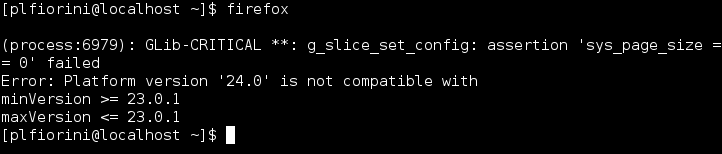
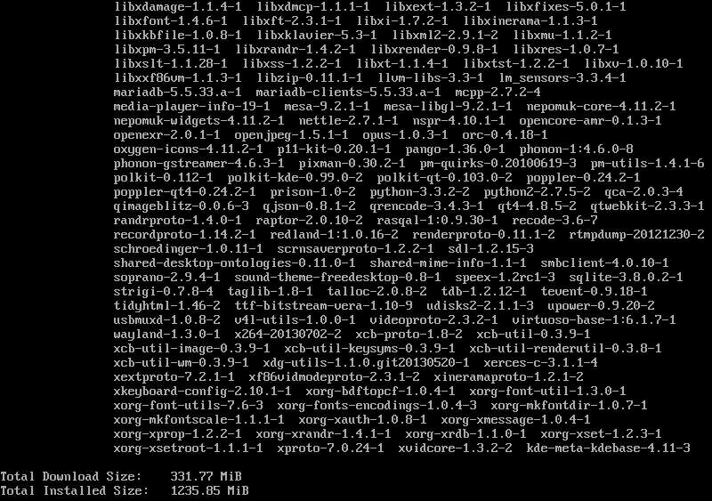
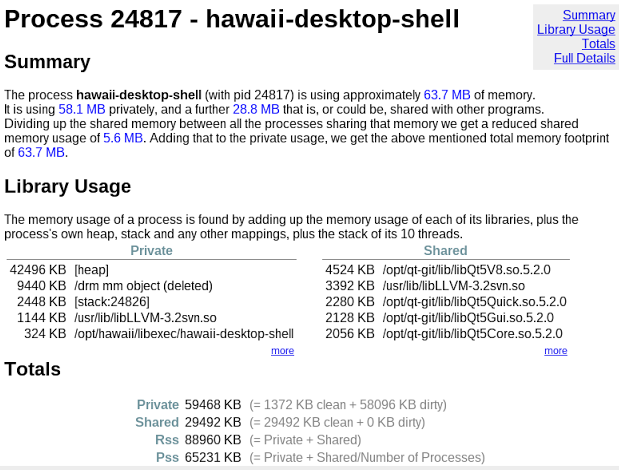

title: Me

- Pier Luigi Fiorini
- qtwayland contributor
- IRC Freenode: plfiorini
- Twitter: @plfiorini
- GooglePlus: +PierLuigiFiorini

---

title: What is this stuff?

Hawaii:

- Low footprint Wayland and QtQuick based desktop
- Less dependencies
- Adapt to different devices
- Customizable layouts, easier styling and theming

Maui:

- Small distro: GNU/Linux stack, Qt, Hawaii
- Convenient way to distribute the desktop
- Atomic and safe updates (OSTree)
- Bundles instead of packages
- Focused on Qt

---

title: Updates often gets in your way
class: nobackground fill
content_class: flexbox vcenter

This is during yum update: the system is in an inconsistent state

---

title: mauibuild
subtitle: What it does now

- Written in Python, derived from gnome-ostree
- Base system built from [Yocto](https://www.yoctoproject.org/)
- Builds git repositories listed in a JSON manifest
- Can build continuosly
- Outputs different trees: runtime, runtime-debug, devel, devel-debug
- Targets bare metal
- Creates live images

---

title: mauibuild
subtitle: Ideas for the future

- Pick a more complete base system (e.g. Mer, Fedora)
- Build a few things from git sources
- Smoke tests and QA

---

title: Updates

- Step 1: fetch updates and apply them atomically
- Step 2: reboot into the updated system

Advantages:

- **If something fails at step 1 you won't reboot into a broken system**
- Updates are atomic, only one reboot
- No need for rescue partitions or BTRFS snapshots
- Ability to reboot into older version in case of regressions
- Same workflow for **upgrades to the new OS release**

---

title: Hawaii: philosophy
class: big

- Only support Wayland
- Minimalist UI
- Adapt to diffent devices and form factors
- Modular desktop with components
- Easy styling and theming thanks to QML
- Promote third party applications
- Collaborate with upstream when possible
- Reuse other libraries when possible

---

title: Few dependencies
class: fill
content_class: flexbox vcenter

---

title: KDE Frameworks

- Less dependencies (especially with tier 1 libs)
- Code ready to be used, less duplication
- More people involved, more stable code
- Larger userbase

---

title: Low memory footprint
content_class: flexbox vcenter

**Consumes approximately 60:70 MB**

---

title: Convergence

- Single code base
- Different layout for different devices
- QFileSelector and QQmlAbstractUrlInterceptor

---

title: Overlay styles

<pre class="prettyprint" data-lang="qml">
import QtQuick 2.0
import Hawaii.Shell.Styles.Base 1.0

OverlayStyle {
    textColor: "white"
    textShadowColor: Qt.rgba(0, 0, 0, 0.7)
    panel: Rectangle {
        border.color: Qt.rgba(0, 0, 0, 0.5)
        gradient: Gradient {
            GradientStop { position: 0.0; color: Qt.rgba(0.13, 0.13, 0.13, 0.7) }
            GradientStop { position: 0.5; color: Qt.rgba(0, 0, 0, 0.7) }
            GradientStop { position: 1.0; color: Qt.rgba(0, 0, 0, 0.7) }
        }
        radius: 6
        antialiasing: true
    }
}
</pre>

---

title: Popup style 1/2

<pre class="prettyprint" data-lang="qml">
import QtQuick 2.0
import QtGraphicalEffects 1.0
import Fluid.Ui 1.0
import Hawaii.Shell.Styles.Base 1.0

PopupStyle {
    padding { left: 8; top: 8; right: 8; bottom: 8 }
    panel: Item {
        Rectangle {
            id: border
            anchors { fill: parent; margins: 8 }
            border.color: "#999"
            radius: 6
            gradient: Gradient {
                GradientStop { position: 0.0; color: "#f4f4f4" }
                GradientStop { position: 1.0; color: "#dcdcdc" }
            }
            visible: false
</pre>

---

title: Popup style 2/2

<pre class="prettyprint" data-lang="qml">
            NoiseBackground {
                anchors { fill: parent; margins: 3 }
                gradient: Gradient {
                    GradientStop { position: 0.0; color: "#f4f4f4" }
                    GradientStop { position: 1.0; color: "#dcdcdc" }
                }
            }
        }
        DropShadow {
            anchors.fill: border; source: border
            radius: 8; samples: 16
            fast: true
            spread: 0
            color: Qt.rgba(0, 0, 0, 0.5)
            transparentBorder: true
        }
    }
}
</pre>

---

title: Features on 0.2.0

- Multiple screens support without primary and secondary outputs
- Launcher, Panel and AppChooser on multiple pages
- Background with crossfade effect
- Modal dialogs, overlays and popups
- Multiple workspaces and switcher
- Windows switcher and Exposé-like presentation
- Lock screen
- PolicyKit agent
- Notifications
- Volume control keys
- Grouped indicators and consolidated menu
- Style API 0.1

---

title: Features for upcoming version

- Switch between different layouts
- First step towards desktop and mobile convergence
- Customizable layouts
- Loadable elements
- Replaceable components (lock screen, ...)
- More modularization
- Screen saver
- Animated wallpapers
- Workspaces overview
- Dropdown windows
- Weston 1.4 support
- Possibly more core apps: Weather and Cinema

---

title: What's next?

- Port SDDM to Wayland
- Improved applications and task management
- Freedesktop.org Notifications 1.2
- More preference modules: keyboard, mouse, screens, ...

---

title: How do I get it?

- Sources: [github.com/mauios](https://github.com/mauios)
- AUR packages for Arch Linux
- Binary packages for Arch Linux (x86_64) always updated
- On going effort on Mer
- Fedora: coming soon

---

title: What you can do to contribute

- Coding (Qt, QML, C/C++)
- UI, styles and Web design
- Graphics (icon themes and such)
- Wallpapers
- Writing documentation (HIG, wiki, manuals, ...)
- Web site (HTML and CSS)
- Help organizing a community space with forums
- Videos and marketing stuff
- Spread the word
- Donate some money
- Donate hardware, server, hosting
- Sponsor development
