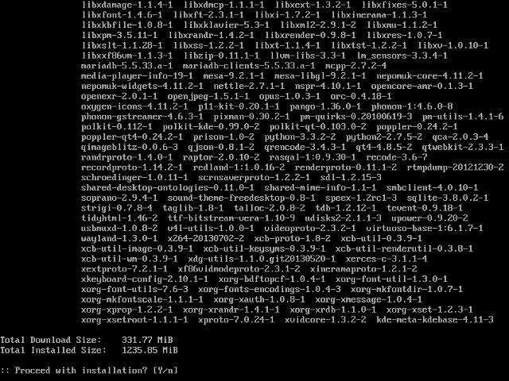

title: Goals
class: big

- Atomic and safe upgrades
- Faster upgrades
- Bundles instead of packages
- Low footprint Wayland and QtQuick based desktop
- Adapt to different form factors

---

title: Maui
subtitle: The Distro
class: segue dark nobackground

---

title: mauibuild
subtitle: What it does now

- Builds git repositories from core up to Hawaii, plus a few apps
- Can build continuosly
- Base system built from [Yocto](https://www.yoctoproject.org/)
- Outputs different variants: runtime, runtime-debug, devel, devel-debug
- Targets bare metal
- Creates live images

---

title: mauibuild
subtitle: Ideas for the future

- Pick a more complete base system (i.e. Fedora minimal) and only build Qt and Hawaii
- Focus on continuous integration and QA tests
- Only target virtualized environments
- No security updates

---

title: OSTree: git for operating system binaries

- Manage a set of read-only, versioned and bootable file system trees
- Pick the best out of package-based and images-based deployment
- Drops flexibility of packages to gain image speed and reliability
- Storage and file system independent (works on all file systems, LLVM, ...)
- Can be served from static HTTP
- Can boot different operating systems and bisect across builds
- Can be used to update virtual guests while offline
- Work in progress: yum integration

---

title: Bundles

- ??

---

title: Hawaii
subtitle: The Desktop
class: segue dark nobackground

---

title: Philosophy
class: big

- Few dependencies
- Submit changes upstream

---

title: Few dependencies

---

title: Submit changes upstream

- qtconfiguration - New configuration API with changes notifications
- qtaccountsservice - Qt wrapper for AccountsService
- fluid - Things missing from QtQuick Controls
- greenisland - Goodies for QtQuick-based compositors
