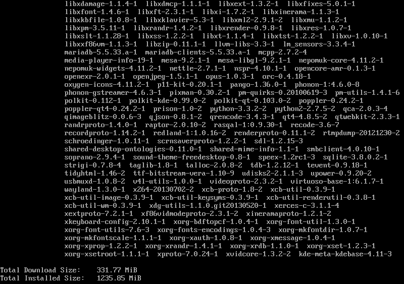

title: Goals
class: big

- Atomic and safe updates and upgrades
- Faster updates: download only what's really changed
- Bundles instead of packages
- Low footprint Wayland and QtQuick based desktop
- Adapt to different form factors
- Fast boot
- Focused on Qt

---

title: Maui
subtitle: The Distro
class: segue dark nobackground

---

title: OSTree: git for operating system binaries

- Manage a set of read-only, versioned and bootable file system trees
- Pick the best out of package-based and images-based deployment
- Drops flexibility of packages to gain image speed and reliability
- Storage and file system independent (works on all file systems, LLVM, ...)
- Can be served from static HTTP
- Can boot different operating systems and bisect across builds
- Can be used to update virtual guests while offline
- Work in progress: yum integration

---

title: mauibuild
subtitle: What it does now

- Builds git repositories from core up to Hawaii, plus a few apps
- Can build continuosly
- Base system built from [Yocto](https://www.yoctoproject.org/)
- Outputs different variants: runtime, runtime-debug, devel, devel-debug
- Targets bare metal
- Creates live images

---

title: mauibuild
subtitle: Ideas for the future

- Pick a more complete base system (i.e. Fedora minimal) and only build Qt and Hawaii
- Focus on continuous integration, smoke tests and QA
- Only target virtualized environments
- No security updates

---

title: Atomic upgrades
class: nobackground fill
content_class: flexbox vcenter

Updates often break your system: this is during yum update

---

title: Fedora offline updates

Fedora implemented [offline updates](http://fedoraproject.org/wiki/Features/OfflineSystemUpdates) (more [here](http://freedesktop.org/wiki/Software/systemd/SystemUpdates/)):

- Step 1: fetch updates
- Step 2: reboot into a special "update mode"
- Step 3: apply updates **(what happens if this fails?)**
- Step 4: reboot into "regular mode"

Downside:

- Too many reboots
- yum update can still break the system
- Difference between OS and application updates is heuristic
- Delta RPMs are per package not per tree diffs

---

title: Maui atomic updates

- Step 1: fetch updates and apply them atomically
- Step 2: reboot into the updated system

Advantages:

- **If something fails at step 1 you won't reboot into a broken system**
- Atomic updates and just one reboot
- No need for rescue partitions or BTRFS snapshots
- Ability to reboot into older version in case of regressions
- Same workflow for **OS upgrades to the new release**

---

title: Bundles

- Multiple versions of the same application at the same time
- OS updates decoupled from application updates

---

title: Hawaii
subtitle: The Desktop
class: segue dark nobackground

---

title: Features for 0.2.0

- Launcher, Panel and paged AppChooser
- Background with crossfade effect
- Modal dialogs
- Overlays
- Multiple workspaces
- Windows switcher
- Exposé-like windows presentation
- Lock screen
- PolicyKit agent
- Notifications
- Audio master controls

---

title: What's next?

- Desktop elements
- Grouped indicators and consolidate menu

---

title: Philosophy
class: big
build_lists: true

- Collaborate with upstream
- Use as many modules as possible from KDE or other sources
- Avoid unnecessary or bloated stuff
- Only support Wayland and Linux
- Adapt to diffent form factors
- Modular desktop with components
- Easy and reliable API for styles

---

title: Few dependencies
class: fill
content_class: flexbox vcenter

---

title: Upstream collaboration

- qtconfiguration - New configuration API with changes notifications
- qtaccountsservice - Qt wrapper for AccountsService
- fluid - Things missing from QtQuick Controls
- greenisland - Goodies for QtQuick-based compositors
- libqtxdg - Qt implementation of XDG standards
- solid - Hardware abstraction layer from KDE
- karchive - Archives framework from KDE

---

title: Styles

<pre class="prettyprint" data-lang="qml">
import QtQuick 2.0
import Hawaii.Shell.Styles.Base 1.0

OverlayStyle {
    textColor: "white"
    textShadowColor: Qt.rgba(0, 0, 0, 0.7)
    panel: Rectangle {
        border.color: Qt.rgba(0, 0, 0, 0.5)
        gradient: Gradient {
            GradientStop { position: 0.0; color: Qt.rgba(0.13, 0.13, 0.13, 0.7) }
            GradientStop { position: 0.5; color: Qt.rgba(0, 0, 0, 0.7) }
            GradientStop { position: 1.0; color: Qt.rgba(0, 0, 0, 0.7) }
        }
        radius: 6
        antialiasing: true
    }
}
</pre>
