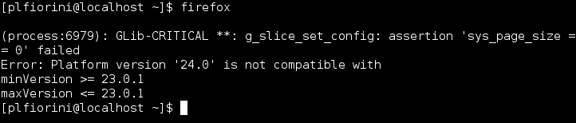
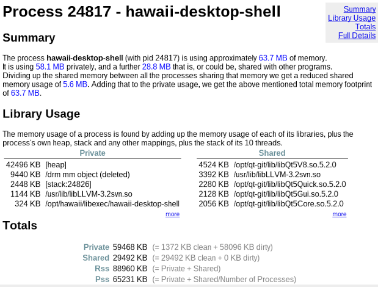

title: Goals
class: big

Linux distribution:

- Atomic, safe updates and upgrades
- Download only what's changed, zlib compressed
- Bundles instead of packages
- Focused on Qt

Desktop:

- Low footprint Wayland and QtQuick based desktop
- Adapt to different form factors
- Fast boot

---

title: Maui
subtitle: Linux distribution
class: segue dark nobackground

---

title: OSTree: git for operating system binaries

- Manage a set of read-only, versioned and bootable file system trees
- Pick the best out of package-based and images-based deployment
- Drops flexibility of packages to gain image speed and reliability
- Can be served from static HTTP
- Can boot different operating systems and bisect across builds
- Storage and file system independent (works on all file systems, LLVM, ...)
- Can be used to update virtual guests while offline
- Work in progress: yum integration (see [here](http://fedorapeople.org/~walters/fedora-ostree/))

---

title: mauibuild
subtitle: What it does now

- Builds git repositories from core up to Hawaii, plus a few apps
- Can build continuosly
- Base system built from [Yocto](https://www.yoctoproject.org/)
- Outputs different variants: runtime, runtime-debug, devel, devel-debug
- Targets bare metal
- Creates live images

---

title: mauibuild
subtitle: Ideas for the future

- Pick a more complete base system (i.e. Fedora minimal) and only build Qt and Hawaii
- Focus on continuous integration, smoke tests and QA
- Only target virtualized environments
- No security updates

---

title: Atomic upgrades
class: nobackground fill
content_class: flexbox vcenter

Updates often break your system: this is during yum update

---

title: Fedora offline updates

Fedora implemented [offline updates](http://fedoraproject.org/wiki/Features/OfflineSystemUpdates) (more [here](http://freedesktop.org/wiki/Software/systemd/SystemUpdates/)):

- Step 1: fetch updates
- Step 2: reboot into a special "update mode"
- Step 3: apply updates **(what happens if this fails?)**
- Step 4: reboot into "regular mode"

Downside:

- Too many reboots
- yum update can still break the system
- Difference between OS and application updates is heuristic
- Delta RPMs are per package not per tree diffs

---

title: Maui atomic updates

- Step 1: fetch updates and apply them atomically
- Step 2: reboot into the updated system

Advantages:

- **If something fails at step 1 you won't reboot into a broken system**
- Updates are atomic, only one reboot
- No need for rescue partitions or BTRFS snapshots
- Ability to reboot into older version in case of regressions
- Same workflow for **upgrades to the new OS release**

---

title: Bundles

- Multiple versions of the same application at the same time
- OS updates decoupled from application updates
- 1:1 relationship between a bundle and an application
- Encourages ABI stability
- Moves the packaging burden to the vendor

---

title: Hawaii
subtitle: Desktop Environment
class: segue dark nobackground

---

title: Philosophy
class: big

- Collaborate with upstream
- Use as many modules as possible from KDE or other sources
- Avoid unnecessary or bloated stuff
- Only support Wayland and Linux
- Adapt to diffent form factors
- Modular desktop with components
- Easy and reliable API for styles

---

title: Features on 0.2.0

- Multiple screens support
- No primary and secondary outputs
- Launcher, Panel and AppChooser on multiple pages
- Background with crossfade effect
- Modal dialogs, overlays and popups
- Multiple workspaces and switcher
- Windows switcher and Exposé-like presentation
- Lock screen
- PolicyKit agent
- Notifications
- Volume control keys
- Grouped indicators and consolidated menu
- QML styles

---

title: Features for upcoming 0.2.1

- Switch between different layouts
- First step towards desktop and mobile convergence
- Customizable layouts
- Loadable elements and components
- Screen saver
- Animated wallpapers

---

title: What's next?

- Improved applications and task management
- Freedesktop.org Notifications 1.2
- More preference modules: keyboard, mouse, screens, ...

---

title: Few dependencies
class: fill
content_class: flexbox vcenter

---

title: Upstream collaboration and reusing

- qtconfiguration - New configuration API with changes notifications
- qtaccountsservice - Qt wrapper for AccountsService
- fluid - Things missing from QtQuick Controls
- greenisland - Goodies for QtQuick-based compositors
- libqtxdg - Qt implementation of XDG standards
- solid - Hardware abstraction layer from KDE
- karchive - Archives framework from KDE

---

title: Low memory footprint
content_class: flexbox vcenter

**Consumes approximately 60:70 MB**

---

title: Styles

<pre class="prettyprint" data-lang="qml">
import QtQuick 2.0
import Hawaii.Shell.Styles.Base 1.0

OverlayStyle {
    textColor: "white"
    textShadowColor: Qt.rgba(0, 0, 0, 0.7)
    panel: Rectangle {
        border.color: Qt.rgba(0, 0, 0, 0.5)
        gradient: Gradient {
            GradientStop { position: 0.0; color: Qt.rgba(0.13, 0.13, 0.13, 0.7) }
            GradientStop { position: 0.5; color: Qt.rgba(0, 0, 0, 0.7) }
            GradientStop { position: 1.0; color: Qt.rgba(0, 0, 0, 0.7) }
        }
        radius: 6
        antialiasing: true
    }
}
</pre>

---

title: How do I get it?

- Sources: [github.com/hawaii-desktop/hawaii](https://github.com/hawaii-desktop/hawaii)
- AUR packages for Archlinux
- Binary packages for Archlinux (x86_64) always updated
- Fedora: coming soon

---

title: What can I do to contribute?

- Coding (Qt, QML, C/C++)
- UI, styles and Web design
- Graphics (icon themes and such)
- Wallpapers
- Writing documentation (HIG, wiki, manuals, ...)
- Web site (HTML and CSS)
- Help organizing a community space with forums
- Videos and marketing stuff
- Spread the word
- Donate some money
- Donate hardware, server, hosting
- Sponsor development
